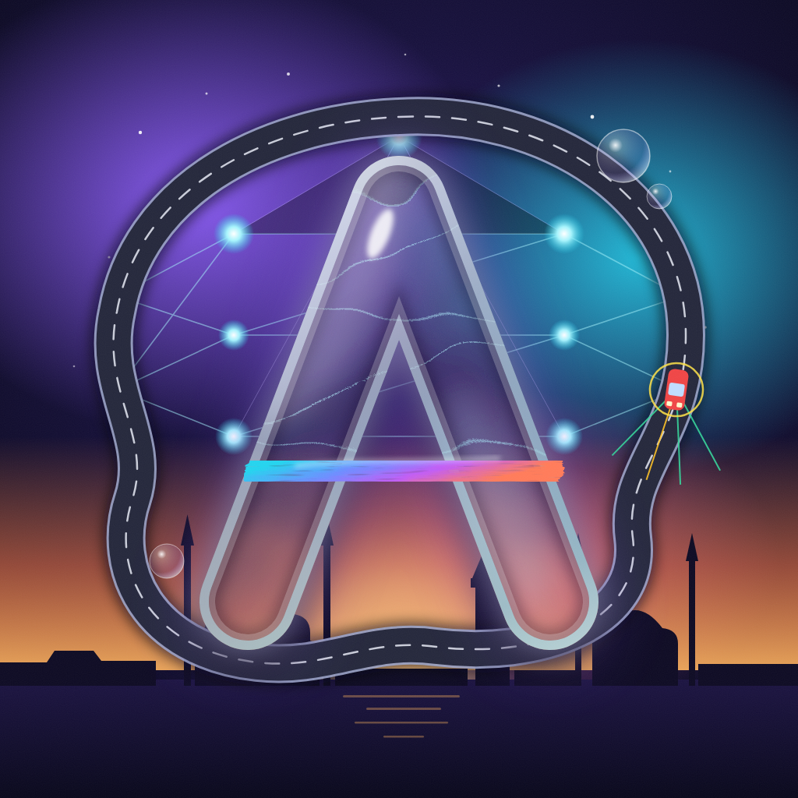

# Alex

**Windows desktop apps, small neural networks and the tests that keep them honest.**

Most of what is here I use myself: a paint program, a local AI workbench, a translator that runs without the internet, a downloads sorter, a folder sync. Every project has a release you can download and run.

Интерфейсы программ на русском, README у каждого проекта на английском и русском.

## Projects

<table>
<tr>
<td width="50%" valign="top">

 <b><a href="https://github.com/ALEXalesha/PaintPro">Paint Pro</a></b> · Electron + C#/WPF
 A raster editor written twice: one HTML file in Electron that also <a href="https://alexalesha.github.io/PaintPro/">runs in the browser</a>, and a native C# twin on SkiaSharp. Layers, a history where any edit can be switched off.
</td>
<td width="50%" valign="top">

 <b><a href="https://github.com/ALEXalesha/Neural-Network">AlexGPT</a></b> · Python, PyTorch, Qt
 A local AI workbench: chat through LM Studio, plus models trained from scratch (translator, named entities, sentiment, spam) and a canvas that reads what you draw.
</td>
</tr>
<tr>
<td width="50%" valign="top">

 <b><a href="https://github.com/ALEXalesha/CalculatorPro">Calculators</a></b> · C#/WPF + Electron
 Three Liquid Glass calculators with their own parsers and no <code>eval</code>. The WPF one counts in <code>decimal</code>, so 0.1 + 0.2 is exactly 0.3.
</td>
<td width="50%" valign="top">

 <b><a href="https://github.com/ALEXalesha/LiquidGlass">Liquid Glass</a></b> · HTML, SVG filters, WebGL2
 The iOS 26 glass rebuilt on the web twice, with refraction, dispersion and live controls. <a href="https://alexalesha.github.io/LiquidGlass/">Open the demo</a>.
</td>
</tr>
<tr>
<td width="50%" valign="top">

 <b><a href="https://github.com/ALEXalesha/AiCar">AiCar</a></b> · NumPy + pygame
 One network draws the track, another the car, and fifty more learn to drive it by evolution, live on screen.
</td>
<td width="50%" valign="top">

 <b><a href="https://github.com/ALEXalesha/SynchronizationApp">SyncGlass</a></b> · Electron
 Folder sync between a laptop and a PC on the network: preview first, moves recognised, and Stop undoes the whole run.
</td>
</tr>
</table>

| Tool | What it does | Stack |
| --- | --- | --- |
| [SaltTranslator](https://github.com/ALEXalesha/SaltTranslator) | Offline translator on NLLB-3.3B, on the CPU: 202 languages plus the languages of Uganda | Python, CTranslate2, Electron |
| [IntelegienceDrawer](https://github.com/ALEXalesha/IntelegienceDrawer) | Draw with the mouse, a CNN reads digits, letters and maths signs, left to right, as numbers or words | PyTorch, tkinter |
| [InstallerModels](https://github.com/ALEXalesha/InstallerModels) | Downloads ComfyUI models back from Hugging Face: resumable, size- and sha256-checked, your own models by link | Python, Qt |
| [SortProgramm](https://github.com/ALEXalesha/SortProgramm) | Sorts the Downloads folder by category and type: plan first, undo always, rules editable from the window | PyQt6 |
| [WheelScript](https://github.com/ALEXalesha/WheelScript) | A racing wheel as mouse, keyboard or a virtual Xbox gamepad, for games that do not understand a wheel | Python, Qt |
| [CheckProg](https://github.com/ALEXalesha/CheckProg) | A checklist with a note on every item; each list is a plain JSON file | Python, Qt |
| [Converter](https://github.com/ALEXalesha/Converter) | Turns a landscape A4 school timetable (.docx or .pdf) into a half-sheet PDF ready to print and cut | Python, Qt |

## How these are made

- **Tests state laws, not examples.** Most suites generate thousands of random inputs (hypothesis, fast-check, FsCheck) and check invariants after every step: a parsed expression prints back to the same tree, undoing everything returns the starting state, a download never leaves a wrong file under the real name. That is where most of the bugs in these repositories were found.
- **Screenshots are drawn by programs, never taken from the screen.** Each project has a script that opens the real app, clicks through it and renders the window itself. The screenshots keep catching bugs too: a white icon in a light theme, `*` where the button says `×`, a transparent frame around a window.
- **Every release is a real build you can run**, a portable one and an installer, with notes that say what was wrong and why, not just what changed.
