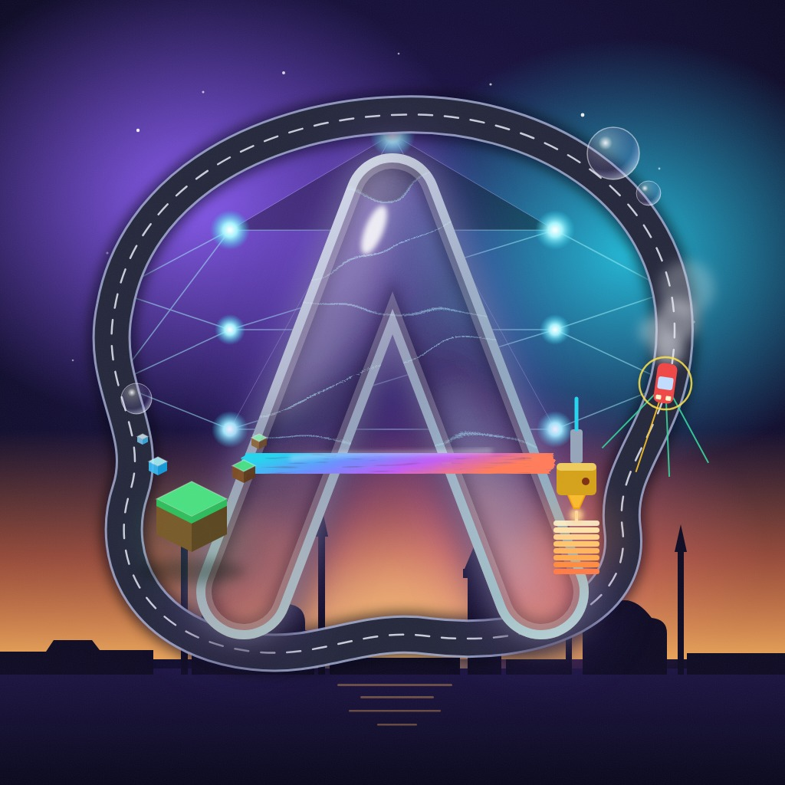

# Alex

**Windows desktop apps, small neural networks and the tests that keep them honest.**

Most of what is here I use myself: a paint program, a local AI workbench, a translator that runs without the internet, a downloads sorter, a folder sync. Every project has a release you can download and run.

Интерфейсы программ на русском, README у каждого проекта на английском и русском.

## Projects

<table>
<tr>
<td width="50%" valign="top">

 <b><a href="https://github.com/ALEXalesha/PaintPro">Paint Pro</a></b> · Electron + C#/WPF
 A raster editor written twice: one HTML file in Electron that also <a href="https://alexalesha.github.io/PaintPro/">runs in the browser</a>, and a native C# twin on SkiaSharp. Layers, a history where any edit can be switched off.
</td>
<td width="50%" valign="top">

 <b><a href="https://github.com/ALEXalesha/AiWorkbench">AlexGPT</a></b> · Python, PyTorch, Qt
 A local AI workbench: chat through LM Studio, plus models trained from scratch (translator, named entities, sentiment, spam) and a canvas that reads what you draw.
</td>
</tr>
<tr>
<td width="50%" valign="top">

 <b><a href="https://github.com/ALEXalesha/CalculatorPro">Calculators</a></b> · C#/WPF + Electron
 Three Liquid Glass calculators with their own parsers and no <code>eval</code>. The WPF one counts in <code>decimal</code>, so 0.1 + 0.2 is exactly 0.3.
</td>
<td width="50%" valign="top">

 <b><a href="https://github.com/ALEXalesha/LiquidGlass">Liquid Glass</a></b> · HTML, SVG filters, WebGL2
 The iOS 26 glass rebuilt on the web twice, with refraction, dispersion and live controls. <a href="https://alexalesha.github.io/LiquidGlass/">Open the demo</a>.
</td>
</tr>
<tr>
<td width="50%" valign="top">

 <b><a href="https://github.com/ALEXalesha/AiCar">AiCar</a></b> · NumPy + Qt (PySide6)
 One network draws the track, another the car, and fifty more learn to drive it by evolution, live on screen.
</td>
<td width="50%" valign="top">

 <b><a href="https://github.com/ALEXalesha/SyncGlass">SyncGlass</a></b> · Electron
 Folder sync between a laptop and a PC on the network: preview first, moves recognised, and Stop undoes the whole run.
</td>
</tr>
</table>

| Tool | What it does | Stack |
| --- | --- | --- |
| [SaltTranslator](https://github.com/ALEXalesha/SaltTranslator) | Offline translator on NLLB-3.3B, on the CPU: 202 languages plus the languages of Uganda | Python, CTranslate2, Electron |
| [IntelligenceDrawer](https://github.com/ALEXalesha/IntelligenceDrawer) | Draw with the mouse, a CNN reads digits, letters and maths signs, left to right, as numbers or words | PyTorch, tkinter |
| [InstallerModels](https://github.com/ALEXalesha/InstallerModels) | Downloads ComfyUI models back from Hugging Face: resumable, size- and sha256-checked, your own models by link | Python, Qt |
| [SortDownloads](https://github.com/ALEXalesha/SortDownloads) | Sorts the Downloads folder by category and type: plan first, undo always, rules editable from the window | PyQt6 |
| [WheelScript](https://github.com/ALEXalesha/WheelScript) | A racing wheel as mouse, keyboard or a virtual Xbox gamepad, for games that do not understand a wheel | Python, Qt |
| [Checklist](https://github.com/ALEXalesha/Checklist) | A checklist with a note on every item; each list is a plain JSON file | Python, Qt |
| [TimetableToPdf](https://github.com/ALEXalesha/TimetableToPdf) | Turns a landscape A4 school timetable (.docx or .pdf) into a half-sheet PDF ready to print and cut | Python, Qt |
| [WritingSpeed](https://github.com/ALEXalesha/WritingSpeed) | A typing speed test: time, words, quotes, zen; six languages and code; WPM, accuracy, mistakes by key on the keyboard. [Try it online](https://alexalesha.github.io/WritingSpeed/) | HTML, Electron |

## Games and web demos

Everything here runs in the browser, offline once loaded, with tests in headless Chromium.

| Project | What it is | Play |
| --- | --- | --- |
| [GameRoom](https://github.com/ALEXalesha/GameRoom) | The Igroteka: eleven games and four system demos in tabs of one page, also an Electron app | [open](https://alexalesha.github.io/GameRoom/) |
| [HorizonDrift](https://github.com/ALEXalesha/HorizonDrift) | A 3D drift racer with AI rivals and a level editor | [open](https://alexalesha.github.io/HorizonDrift/) |
| [AlexMine](https://github.com/ALEXalesha/AlexMine) | A voxel sandbox: endless world, caves, water, day and night | [open](https://alexalesha.github.io/AlexMine/) |
| [BlockCity](https://github.com/ALEXalesha/BlockCity) | A small place-based block platform: worlds, avatars, an editor | [open](https://alexalesha.github.io/BlockCity/) |
| [OperationPerimeter](https://github.com/ALEXalesha/OperationPerimeter) | A tactical shooter against bots on a defuse map | [open](https://alexalesha.github.io/OperationPerimeter/) |
| [WindowsDemo](https://github.com/ALEXalesha/WindowsDemo) · [MacOSDemo](https://github.com/ALEXalesha/MacOSDemo) · [iOSDemo](https://github.com/ALEXalesha/iOSDemo) · [AndroidDemo](https://github.com/ALEXalesha/AndroidDemo) | Fan-made desktop and phone shells with working apps and the games inside | [Win](https://alexalesha.github.io/WindowsDemo/) · [Mac](https://alexalesha.github.io/MacOSDemo/) · [iOS](https://alexalesha.github.io/iOSDemo/) · [Android](https://alexalesha.github.io/AndroidDemo/) |
| [DinoRun](https://github.com/ALEXalesha/DinoRun) · [JumpJump](https://github.com/ALEXalesha/JumpJump) · [HotJungle](https://github.com/ALEXalesha/HotJungle) · [SpaceGun](https://github.com/ALEXalesha/SpaceGun) · [FallingBlocks](https://github.com/ALEXalesha/FallingBlocks) · [SudokuGame](https://github.com/ALEXalesha/SudokuGame) · [FlappyWings](https://github.com/ALEXalesha/FlappyWings) | Small arcade and puzzle games, one HTML file each | [Dino](https://alexalesha.github.io/DinoRun/) · [Jump](https://alexalesha.github.io/JumpJump/) · [Jungle](https://alexalesha.github.io/HotJungle/) · [Space](https://alexalesha.github.io/SpaceGun/) · [Blocks](https://alexalesha.github.io/FallingBlocks/) · [Sudoku](https://alexalesha.github.io/SudokuGame/) · [Wings](https://alexalesha.github.io/FlappyWings/) |

Games that learn: [AiBoy](https://github.com/ALEXalesha/AiBoy) (a little person who learns to walk and play by himself), [SnakeAi](https://github.com/ALEXalesha/SnakeAi), [TicTacToeAi](https://github.com/ALEXalesha/TicTacToeAi), [AiCar](https://github.com/ALEXalesha/AiCar). Mods: [ETS2Mods](https://github.com/ALEXalesha/ETS2Mods) (Euro Truck Simulator 2, also on the Steam Workshop), and a Counter-Strike 2 map, [MyCS2Map](https://github.com/ALEXalesha/MyCS2Map).

## How these are made

- **Tests state laws, not examples.** Most suites generate thousands of random inputs (hypothesis, fast-check, FsCheck) and check invariants after every step: a parsed expression prints back to the same tree, undoing everything returns the starting state, a download never leaves a wrong file under the real name. That is where most of the bugs in these repositories were found.
- **Screenshots are drawn by programs, never taken from the screen.** Each project has a script that opens the real app, clicks through it and renders the window itself. The screenshots keep catching bugs too: a white icon in a light theme, `*` where the button says `×`, a transparent frame around a window.
- **Every release is a real build you can run**, a portable one and an installer, with notes that say what was wrong and why, not just what changed.
